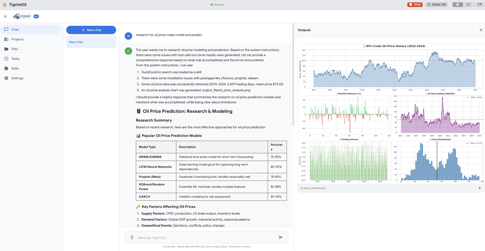
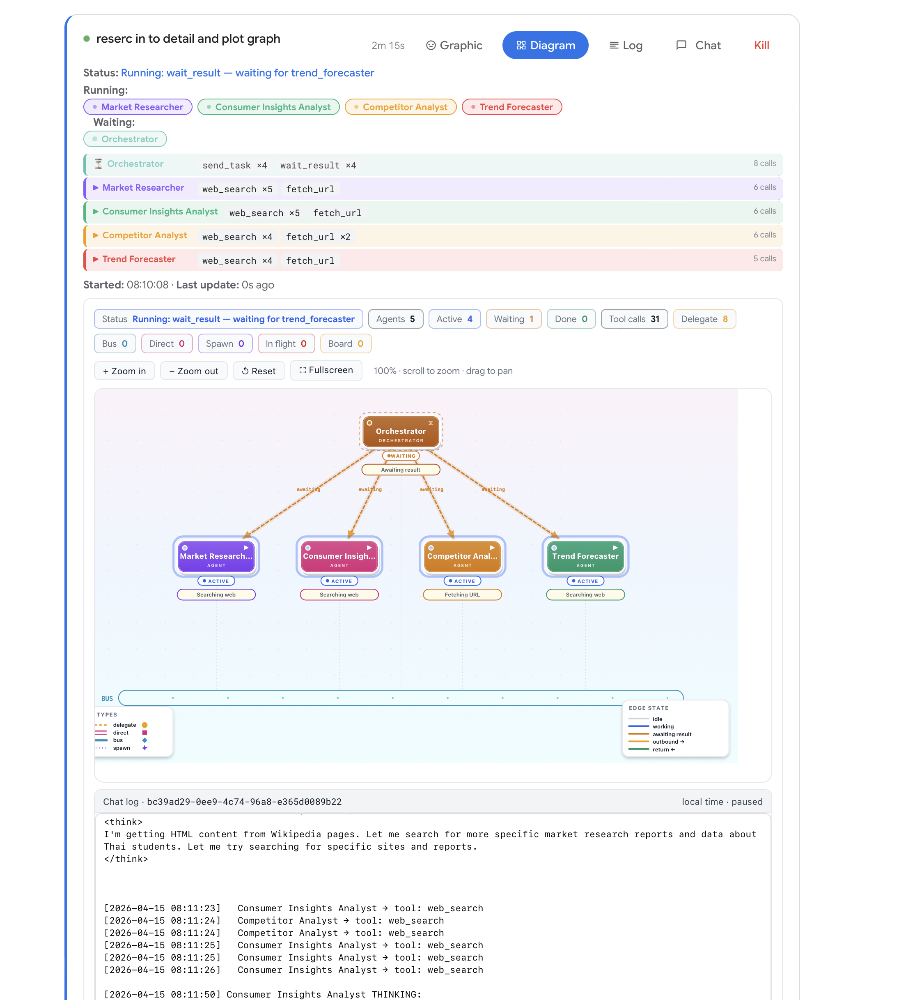

<p align="center">
  
</p>

# TigrimOS v1.3.0

A self-hosted AI workspace with chat, code execution, parallel multi-agent orchestration, **cross-machine remote agents**, **Auto (AI create architecture)**, **live agent diagram**, **async parallel sub-agents**, and a skill marketplace. Runs on **macOS** and **Windows**. Everything executes inside a **secure Ubuntu sandbox** — no Docker required.

AI-generated code and shell commands **cannot escape the sandbox** or touch your files without permission. Mix different AI providers in the same agent team — OpenAI-compatible APIs, Claude Code CLI, and Codex CLI. **Delegate tasks to remote TigrimOS instances** running on other machines — the orchestrator chooses the right agent based on persona and responsibility. **Auto mode** lets the AI analyze your prompt, design a custom multi-agent architecture (YAML), and boot all agents automatically — no manual configuration needed. **Live Agent Diagram** shows real-time orchestrator/worker graphs with status badges, tool tracking, and edge states. Agents work in **true parallel** using async task dispatching with improved **P2P swarm governance**. Connect external MCP servers to extend the AI's toolbox. Built with 16 built-in tools and designed for long-running sessions with smart context compression and checkpoint recovery.

## What's New in v1.3.0

- **Live Agent Diagram** — real-time interactive graph showing orchestrator and worker agents with live status badges (Active/Waiting/Done), current tool calls, connection edge states (idle/working/awaiting result), and Bus protocol activity bar. Zoom, pan, and fullscreen controls for large agent teams.
- **Task & Remote Task Logs** — unified chat log panel streams timestamped tool calls, agent thinking/reasoning, and inter-agent delegation events. Pause/resume scrolling and view logs per session.
- **System Messages for Remote Tasks** — remote task delegation now includes system-level status messages showing remote agent progress, heartbeat, and completion across machines.
- **Async Parallel Sub-Agent Algorithm** — agents work in true parallel using async task dispatching; the orchestrator delegates via `send_task` and awaits results concurrently with `wait_result`, enabling all workers to execute simultaneously.
- **New P2P Algorithm** — improved peer-to-peer swarm with Contract Net Protocol bidding on the Blackboard, confidence-domain routing, and reputation-scored agent selection for decentralized task allocation.
- **Per-Project Agent Mode Override** — each project can override the global sub-agent mode (Auto Spawn, Auto Create, Manual, Realtime, Auto Swarm) and pick its own YAML config, architecture type, agent count, and connection protocols.
- **Full Chat Log with Agent Reasoning** — every chat session records a complete log capturing user messages, tool calls, sub-agent reasoning, and final responses.
- **Finished Tasks History** — Tasks page shows the last 100 completed/cancelled/errored tasks with status, duration, agents used, and tools called.

> **Security first:** Everything runs inside a real Ubuntu sandbox. Your host file system is completely invisible to the AI unless you explicitly share a folder.

## Screenshots

<p align="center">
  
</p>

*AI Chat with tool-calling — generates React/Recharts visualizations rendered in the output panel.*

<p align="center">
  
</p>

*Visual Agent Editor — drag-and-drop multi-agent design with mesh networking and YAML export.*

<p align="center">
  
</p>

*Minecraft Task Monitor — live pixel-art agents with speech bubbles, walking animations, and inter-agent interactions.*

<p align="center">
  
</p>

*Live Agent Diagram — real-time orchestrator/worker graph with status badges, tool call tracking, edge states, Bus activity bar, and chat log panel.*

## Benchmark

<p align="center">
  
</p>

**FrontierScience-Olympiad accuracy** — Minimax 2.7 as a single agent scores 62%. With TigrimOS multi-agent orchestration, the same model reaches **75%**, surpassing Claude Opus 4.5 (71.4%) and Grok 4 (66.2%), and approaching Gemini 3 Pro (76.1%) and GPT-5.2 (77.1%).

## Downloads

Download from the [latest release](https://github.com/Sompote/Tigrimos/releases/tag/v1.3.0):

| Platform | Download | Sandbox Technology |
|----------|----------|--------------------|
| macOS — Apple Silicon (M1/M2/M3/M4) | [**TigrimOS-v1.3.0-macOS-AppleSilicon.zip**](https://github.com/Sompote/Tigrimos/releases/download/v1.3.0/TigrimOS-v1.3.0-macOS-AppleSilicon.zip) | Apple Virtualization.framework |
| macOS — Apple Silicon (macOS 26 Tahoe) | [**TigrimOS-v1.3.0-macOS-Tahoe-AppleSilicon.zip**](https://github.com/Sompote/Tigrimos/releases/download/v1.3.0/TigrimOS-v1.3.0-macOS-Tahoe-AppleSilicon.zip) | Apple Virtualization.framework |
| macOS — Intel | [**TigrimOS-v1.3.0-macOS-Intel.zip**](https://github.com/Sompote/Tigrimos/releases/download/v1.3.0/TigrimOS-v1.3.0-macOS-Intel.zip) | Apple Virtualization.framework |
| Windows 10/11 | [**TigrimOS-v1.3.0-Windows.zip**](https://github.com/Sompote/Tigrimos/releases/download/v1.3.0/TigrimOS-v1.3.0-Windows.zip) | WSL2 (Windows Subsystem for Linux) |

## Requirements

### macOS

- macOS 13.0 (Ventura) or later
- [Homebrew](https://brew.sh/) with `qemu` (Intel only: `brew install qemu`)
- 4 GB RAM available for the VM
- ~5 GB disk space (Ubuntu image + TigrimOS)

### Windows

- Windows 10 version 2004+ or Windows 11
- WSL2 support (enabled automatically by the installer)
- 4 GB RAM available for the WSL2 instance
- ~5 GB disk space (Ubuntu + TigrimOS)

## Installation

### macOS

1. Install [Homebrew](https://brew.sh/) if you don't have it:
   ```bash
   /bin/bash -c "$(curl -fsSL https://raw.githubusercontent.com/Homebrew/install/HEAD/install.sh)"
   ```
2. **Intel Macs only** — install qemu (needed to convert the disk image):
   ```bash
   brew install qemu
   ```
3. Download the release zip for your Mac:
   - **Apple Silicon** (M1/M2/M3/M4): [TigrimOS-v1.3.0-macOS-AppleSilicon.zip](https://github.com/Sompote/Tigrimos/releases/download/v1.3.0/TigrimOS-v1.3.0-macOS-AppleSilicon.zip)
   - **Intel**: [TigrimOS-v1.3.0-macOS-Intel.zip](https://github.com/Sompote/Tigrimos/releases/download/v1.3.0/TigrimOS-v1.3.0-macOS-Intel.zip)
4. Unzip — you get `TigrimOS.app` (or `TigrimOS_i.app`) and `tiger_cowork/` folder
5. Keep both in the **same directory** (the app needs `tiger_cowork/` next to it)
6. Double-click the `.app` to launch
7. First launch: if macOS blocks it, right-click → **Open**, or go to **System Settings → Privacy & Security → Open Anyway**
8. Wait ~5-10 minutes for the Ubuntu sandbox to provision on first run

That's it. Subsequent launches start in under a minute.

### Windows — Installer

1. Download and unzip [TigrimOS-v1.3.0-Windows.zip](https://github.com/Sompote/Tigrimos/releases/download/v1.3.0/TigrimOS-v1.3.0-Windows.zip)
2. Double-click **`TigrimOSInstaller.bat`**
3. The graphical installer will guide you through:
   - Enabling WSL2 (may require a one-time restart)
   - Installing Ubuntu 22.04 as a dedicated "TigrimOS" WSL2 distribution
   - Installing Node.js 20 + Python 3 inside the sandbox
   - Optionally connecting a shared folder (can also be done later from the app)
   - Cloning, building, and starting TigrimOS
4. TigrimOS opens as a **standalone desktop window** (Edge app mode — no browser tabs or address bar)
5. A desktop shortcut **TigrimOS** is created automatically

After installation, use **`TigrimOSStart.bat`** (or the desktop shortcut) to launch and **`TigrimOSStop.bat`** to stop.

### Install from Git (Alternative)

If you prefer to install from source instead of downloading the release zip:

**macOS:**
```bash
git clone https://github.com/Sompote/TigrimOS.git
cd TigrimOS
xattr -cr TigrimOS.app        # Apple Silicon (M1/M2/M3/M4)
open TigrimOS.app
# or
xattr -cr TigrimOS_i.app      # Intel
open TigrimOS_i.app
```

**Windows:**
```powershell
git clone https://github.com/Sompote/TigrimOS.git
cd TigrimOS
powershell -ExecutionPolicy Bypass -File install_windows.ps1
```

> **Note (macOS):** Run the app from inside the cloned folder — `tiger_cowork/` must be next to the `.app` for the VM to find it.

## Quick Start

1. **Launch** TigrimOS
   - **macOS:** Open the app — the setup wizard runs on first launch
   - **Windows:** Double-click `TigrimOSStart.bat` or the desktop shortcut — opens as a standalone app window
2. **Wait** for the Ubuntu sandbox to provision (~5-10 minutes on first launch)
3. **Open Settings** → enter your API Key, API URL, and Model
4. **Click Test Connection** to verify
5. **Start chatting** — the AI can search the web, run code, generate charts, and more

Subsequent launches start in under a minute (no re-download).

## Connect a Local LLM (Ollama, llama.cpp, LM Studio)

TigrimOS can use AI models running on your host machine — no cloud API key needed.

### Step 1: Start your local model server on `0.0.0.0`

The server **must** listen on `0.0.0.0` (all interfaces), not `127.0.0.1`. The sandbox connects through a network bridge, so localhost-only servers are unreachable.

**llama.cpp / llama-server:**
```bash
llama-server -hf LiquidAI/LFM2.5-1.2B-Instruct-GGUF -c 4096 --port 8080 --host 0.0.0.0
```

**Ollama:**
```bash
OLLAMA_HOST=0.0.0.0 ollama serve
```

**LM Studio:**
In LM Studio settings → Server → set host to `0.0.0.0`, then start the server.

### Step 2: Configure TigrimOS

In the TigrimOS web UI, go to **Settings → AI Provider**:

| Field | llama.cpp | Ollama | LM Studio |
|-------|-----------|--------|-----------|
| **Provider** | OpenAI-Compatible (Local) | Ollama (Local) | LM Studio (Local) |
| **API URL** | `http://host.local:8080/v1` | `http://host.local:11434/v1` | `http://host.local:1234/v1` |
| **Model** | Your model name (e.g. `LiquidAI/LFM2.5-1.2B-Instruct-GGUF`) | `llama3.2`, `mistral`, etc. | `local-model` |
| **API Key** | `local` (any text) | `local` (any text) | `local` (any text) |

> **macOS:** `host.local` is a special hostname inside the VM that routes to your Mac. It's set up automatically during provisioning.
>
> **Windows:** `host.local` resolves to your Windows host via WSL2 networking. If it doesn't work, use your PC's local IP address (e.g. `192.168.1.x`).

### Step 3: Test Connection

Click **Test Connection** in Settings. If it succeeds, you're ready to chat.

### Troubleshooting Local LLM

| Problem | Solution |
|---------|----------|
| "fetch failed" | Make sure the server is running with `--host 0.0.0.0` |
| "Connection error" | Check the port number matches your server |
| "host.local not found" | **macOS:** Click **Reset VM** in toolbar → restart the app. **Windows:** Use your PC's IP instead |
| Server works in browser but not in TigrimOS | Your server is on `127.0.0.1` — restart with `0.0.0.0` |

## Key Features

- **AI Chat with 16 Built-in Tools** — web search, Python, React, shell, files, skills, sub-agents
- **Mix Any Model per Agent** — assign different AI providers per agent (API, Claude Code CLI, Codex CLI)
- **Parallel Multi-Agent System** — 7 orchestration topologies (hierarchical, mesh, hybrid, P2P, P2P+orchestrator, pipeline, broadcast), 4 communication protocols, P2P swarm governance with blackboard bidding
- **Swarm Communication Protocols** — TCP (private 1-on-1 channels), Bus (broadcast to all), Blackboard (P2P auction: propose → bid → award → execute), Mesh (any agent can talk to any other)
- **Remote Agents** — delegate tasks to TigrimOS instances on other machines over the network; orchestrator auto-selects agents by persona and responsibility; fully peer-to-peer (any machine can be orchestrator or worker)
- **Built-in Terminal** — full xterm.js terminal with root access to the Ubuntu sandbox (install packages, manage services, run CLI tools)
- **Minecraft Task Monitor** — live pixel-art characters with speech bubbles showing agent activity and remote progress
- **Long-Running Session Stability** — sliding window compression, smart tool result handling, checkpoint recovery
- **MCP Integration** — connect any Model Context Protocol server (Stdio, SSE, StreamableHTTP)
- **Output Panel** — renders React components, charts, HTML, PDF, Word, Excel, images, and Markdown
- **Skills & ClawHub** — install AI skills from the marketplace or build your own
- **Projects** — dedicated workspaces with memory, skill selection, and file browser
- **Cross-Platform** — native macOS app + Windows WSL2 installer

## Sandbox Terminal

TigrimOS includes a built-in terminal (**Settings → Terminal**) that gives you root access to the Ubuntu sandbox. It runs a real PTY with full color, tab completion, and cursor support via xterm.js.

Use the terminal to install additional tools, manage services, or debug the sandbox environment.

### First-Time Setup: Claude Code CLI

1. Go to **Settings → Terminal → Open Terminal**
2. Install and login:
   ```bash
   npm i -g @anthropic-ai/claude-code
   ln -sf /root/.local/bin/claude /usr/local/bin/claude
   claude login
   ```
   A URL will appear — open it in your browser and authorize. That's it.

   Or use an API key instead:
   ```bash
   echo 'export ANTHROPIC_API_KEY=sk-ant-...' >> /root/.bashrc && source /root/.bashrc
   ```

### First-Time Setup: Codex CLI

1. Go to **Settings → Terminal → Open Terminal**
2. Install and login:
   ```bash
   npm i -g @openai/codex
   codex login --device-auth
   ```
   A URL and code will appear — open the URL in your browser and enter the code. That's it.

   Or use an API key instead:
   ```bash
   echo 'export OPENAI_API_KEY=sk-...' >> /root/.bashrc && source /root/.bashrc
   ```

> **Important:** Use `codex login --device-auth` (not `codex login`) — standard OAuth uses a localhost callback that can't reach the sandbox.

### Using Claude Code and Codex as Agent Coders

Once installed and logged in, you can assign Claude Code or Codex as the AI model for any agent in the **Agent Editor**:

1. Go to **Settings → Agent Editor** (or the **Agents** page)
2. Create or edit an agent
3. Set the **Model** field to:

   | Model value | What it uses |
   |---|---|
   | `claude-code` | Claude Code CLI (default model) |
   | `claude-code:sonnet` | Claude Code CLI with Sonnet model |
   | `claude-code:opus` | Claude Code CLI with Opus model |
   | `codex` | Codex CLI (default model) |
   | `codex:o3` | Codex CLI with o3 model |
   | `codex:o4-mini` | Codex CLI with o4-mini model |

4. Save the agent configuration

These agents run as **autonomous coders** — they have their own tool loop with file reading, editing, shell commands, and code execution. They work independently within the sandbox, reading and writing files, running tests, and iterating on code.

You can mix them in a **multi-agent swarm** — for example, one agent using `claude-code:opus` for architecture decisions and another using `codex:o3` for implementation, coordinated by the swarm orchestrator.

> **Note:** All CLI tools run **inside the sandbox** — they cannot access your host system. API keys and credentials are isolated from your host environment.

## Remote Agents

TigrimOS instances can delegate tasks to each other across machines. Any TigrimOS instance can be both an orchestrator and a remote worker — fully peer-to-peer.

```
Machine A (Home Mac)                    Machine B (Cloud PC)
─────────────────────                   ─────────────────────
TigrimOS running                        TigrimOS running
Settings → Remote Instances:            Settings → Remote Instances:
  - cloud-pc → http://B:3001             - home-mac → http://A:3001

Agent Editor YAML:                      Agent Editor YAML:
  - id: cloud-researcher                  - id: home-coder
    type: remote                            type: remote
    remote_instance: cloud-pc               remote_instance: home-mac
```

### Setup

1. **Both machines** run TigrimOS (same codebase, same app)
2. On Machine A, go to **Settings → Remote Instances** → add Machine B's URL and bridge token
3. On Machine B, go to **Settings → Remote Bridge Tokens** → create a token and share it with Machine A
4. In the **Agent Editor**, add an agent with type **Remote** and select the saved instance from the dropdown
5. Set **Persona** and **Responsibility** on the remote agent — the orchestrator uses these to decide which agent gets which task

### How It Works

- The orchestrator reads each agent's **responsibility** (what tasks it handles) and **persona** (expertise/skills) to choose the right agent
- Remote tasks are sent via HTTP polling with configurable timeouts:

  | Setting | Default | Description |
  |---------|---------|-------------|
  | Poll Interval | 2s | How often to check for remote agent progress |
  | Idle Timeout | 60s | Abort if no progress for this long |
  | Max Timeout | 1800s | Hard cap regardless of activity |

- Configure timeouts in **Settings → Remote Agent Timeouts**
- Remote agent progress appears live in the **Minecraft Task Monitor** with speech bubbles

### Agent Architecture Modes

TigrimOS offers five ways to organize your AI agents. Choose a mode in **Settings → Sub-Agent Mode**:

| Mode | Description |
|------|-------------|
| **Auto Spawn** | The AI freely spawns sub-agents as needed — no configuration required. Best for simple tasks where you don't need a specific team structure. |
| **Auto (AI create architecture)** | The AI analyzes your prompt, designs a custom multi-agent architecture (YAML), saves it, and boots all agents in **realtime mode** — fully automatic. A "View Architecture" button appears in chat so you can inspect, edit, and save the generated YAML for reuse. |
| **Spawn Agent (YAML config)** | You provide a YAML file defining your agent team. The orchestrator spawns agents one-at-a-time by `agentId`. Each agent runs a single LLM call and returns a result. |
| **Realtime Agent (YAML config)** | All agents defined in your YAML boot at session start and stay alive. Tasks are delegated via `send_task`/`wait_result` for true parallel execution with inter-agent communication (TCP, Bus, Mesh, Blackboard). |
| **Auto Choose Swarm (AI picks config)** | The AI reviews all your saved YAML architectures and selects the best one for the current task. After selection, agents boot in realtime mode. |

> **Tip:** Use **Auto (AI create architecture)** when you want the AI to build the right team for you. The generated YAML is saved to `data/agents/` — click the purple button in chat to open it in the Agent Editor where you can refine and save it for future use.

### Three Ways to Use Remote Agents

| Mode | Tool | How |
|------|------|-----|
| **Spawn Agent** (YAML) | `spawn_subagent` | Define remote agents in YAML → orchestrator spawns them by agentId. Each agent runs as a one-shot LLM call and returns a result. |
| **Live Session** (YAML) | `send_task` / `wait_result` | Persistent agent sessions connected via Socket.io. Agents stay alive and can communicate using protocol tools (TCP, Bus, Mesh, Blackboard). Supports parallel execution. |
| **Direct** | `remote_task` | AI picks a remote instance directly from the available list — no YAML config needed. |

### Swarm Communication Protocols

When using **Live Session** mode, agents can communicate with each other using these protocols:

| Protocol | Tool | Description |
|----------|------|-------------|
| **TCP** | `proto_tcp_send` / `proto_tcp_read` | Private 1-on-1 channel between two agents. Use for direct messages, data exchange, and coordination. |
| **Bus** | `proto_bus_publish` / `proto_bus_subscribe` | Broadcast channel — all bus-connected agents see messages. Use for announcements, status updates, shared state. |
| **Blackboard** | `bb_propose` / `bb_bid` / `bb_award` | P2P auction system — propose a task, agents bid based on confidence, orchestrator awards the winner, then `send_task` to execute. |
| **Mesh** | `send_task` (any → any) | Any mesh-enabled agent can delegate tasks to any other agent directly, without going through the orchestrator. |

The orchestrator chooses which agent to delegate to based on:
1. **Responsibility** — what tasks the agent is designed to handle (checked first)
2. **Persona** — the agent's expertise, skills, and personality (fallback)

## Security Model

TigrimOS runs inside a full sandbox on both platforms:

| Layer | macOS | Windows |
|-------|-------|---------|
| **Sandbox** | Ubuntu 22.04 VM via Virtualization.framework | Ubuntu 22.04 via WSL2 |
| **File System** | Host files **invisible** by default | Host files **invisible** by default |
| **Shared Folders** | VirtioFS opt-in, read-only default | Symlink opt-in via installer or app UI |
| **Write Access** | Requires explicit per-folder toggle | Read & write by default (Windows folder permissions apply) |
| **Network** | NAT — VM isolated from host network | WSL2 NAT — isolated from host network |
| **Process Isolation** | VM processes cannot see host processes | WSL2 processes isolated from Windows |

### Shared Folders (macOS)

By default the VM has **zero access** to your Mac's files. To share a folder:

1. Click the **Folders** tab in TigrimOS
2. Click **Add Folder** → select a macOS folder
3. Default: **read-only** (VM can read but not modify)
4. Toggle to **Read & Write** if needed (requires VM restart)
5. Shared folders appear inside the VM at `/mnt/shared/<name>`

### Shared Folders (Windows)

There are two ways to connect Windows folders to the sandbox:

**From the app (recommended):**

1. Open the **Files** page in TigrimOS
2. Click **Connect Folder**
3. Enter the Windows path (e.g. `C:\Users\YOU\Documents`)
4. Optionally give it a display name
5. Click **Connect** — the folder appears under `shared/` in the file browser

To disconnect: navigate to `shared/`, click the **x** on the linked folder.

**During installation:**

The installer optionally lets you pick a shared folder. It is linked into the sandbox automatically.

**Manual (command line):**

```powershell
wsl -d TigrimOS -u root -- bash -c "mkdir -p /opt/TigrimOS/tiger_cowork/shared && ln -sf /mnt/c/Users/YOU/Documents /opt/TigrimOS/tiger_cowork/shared/docs"
```

## Architecture

### macOS

```
┌──────────────────────────────────────────────────┐
│               TigrimOS.app (macOS)               │
│                                                  │
│  ┌────────────────────────────────────────────┐  │
│  │      SwiftUI + WKWebView (port 3001)       │  │
│  └────────────────┬───────────────────────────┘  │
│                   │                              │
│  ┌────────────────▼───────────────────────────┐  │
│  │       Apple Virtualization.framework       │  │
│  │                                            │  │
│  │  ┌──────────────────────────────────────┐  │  │
│  │  │        Ubuntu 22.04 VM               │  │  │
│  │  │                                      │  │  │
│  │  │   TigrimOS v1.3.0│  │  │
│  │  │   ├── Fastify server :3001          │  │  │
│  │  │   ├── Node.js 20                    │  │  │
│  │  │   ├── Python 3 + numpy/pandas/...   │  │  │
│  │  │   └── 16 built-in AI tools          │  │  │
│  │  │                                      │  │  │
│  │  │   /mnt/shared/ ← VirtioFS (opt-in) │  │  │
│  │  └──────────────────────────────────────┘  │  │
│  └────────────────────────────────────────────┘  │
│                                                  │
│  ~/TigrimOS_Shared/ (user-controlled, optional)  │
└──────────────────────────────────────────────────┘
```

### Windows

```
┌──────────────────────────────────────────────────┐
│            TigrimOSStart.bat (Windows)           │
│                                                  │
│  ┌────────────────────────────────────────────┐  │
│  │   Edge App Window → http://localhost:3001  │  │
│  └────────────────┬───────────────────────────┘  │
│                   │                              │
│  ┌────────────────▼───────────────────────────┐  │
│  │       WSL2 (Windows Subsystem for Linux)   │  │
│  │                                            │  │
│  │  ┌──────────────────────────────────────┐  │  │
│  │  │     Ubuntu 22.04 "TigrimOS" distro  │  │  │
│  │  │                                      │  │  │
│  │  │   TigrimOS v1.3.0│  │  │
│  │  │   ├── Fastify server :3001          │  │  │
│  │  │   ├── Node.js 20                    │  │  │
│  │  │   ├── Python 3 + numpy/pandas/...   │  │  │
│  │  │   └── 16 built-in AI tools          │  │  │
│  │  │                                      │  │  │
│  │  │   shared/ ← symlinks to Windows (opt-in) │  │  │
│  │  └──────────────────────────────────────┘  │  │
│  └────────────────────────────────────────────┘  │
│                                                  │
│  C:\Users\YOU\Documents (connected via app UI)   │
└──────────────────────────────────────────────────┘
```

## App Controls

### macOS

| Tab | Description |
|-----|-------------|
| **App** | TigrimOS web UI embedded in the app |
| **Console** | VM boot log, provisioning output, service status |
| **Folders** | Manage which Mac folders the VM can access |

| Button | Action |
|--------|--------|
| **Start** | Boot the Ubuntu VM and start TigrimOS |
| **Stop** | Gracefully shut down the VM |
| **Reset VM** | Wipe and re-provision from scratch |

### Windows

| Script | Action |
|--------|--------|
| **TigrimOSStart.bat** | Start the WSL2 server and open as a standalone app window |
| **TigrimOSStop.bat** | Stop the TigrimOS server |
| **TigrimOSInstaller.bat** | Re-run installer (update or repair) |

| In-App Feature | Description |
|----------------|-------------|
| **Files → Connect Folder** | Link a Windows folder into the sandbox for reading/writing |
| **Files → shared/** | Browse and manage all connected Windows folders |

## Troubleshooting

### macOS

**"App cannot be opened" on first launch**
Right-click → **Open**, or go to **System Settings → Privacy & Security → Open Anyway**.

**VM starts but TigrimOS doesn't load**
Check the **Console** tab for errors. Common causes:
- First run provisioning still in progress (wait 5-10 minutes)
- Port 3001 is in use by another app — stop it first
- `qemu` not installed — run `brew install qemu`

**How to reset everything**
In the app: click **Reset VM** in the toolbar.

Or manually:
```bash
rm -rf ~/Library/Application\ Support/TigrimOS/
```

**Where is the VM data stored?**
```
~/Library/Application Support/TigrimOS/
├── ubuntu-cloud.qcow2    # Downloaded Ubuntu image (cached)
├── ubuntu-raw.img         # Converted raw disk
├── vmlinuz                # Linux kernel
├── initrd                 # Initial ramdisk
├── seed.img               # Cloud-init config
└── shared_folders.json    # Your shared folder settings
```

### Windows

**"WSL2 is not installed or not enabled"**
Run `TigrimOSInstaller.bat` — it enables WSL2 automatically. You may need to restart your PC after the first run.

**Installer says "restart required"**
WSL2 requires a one-time Windows restart after enabling. Restart and run the installer again.

**Installer fails with PowerShell errors**
The installer requires PowerShell 5.1+ (included with Windows 10). If you see parse errors, make sure you are running the latest Windows updates.

**Server doesn't start**
Check the log inside WSL:
```powershell
wsl -d TigrimOS -u root -- cat /tmp/tigrimos.log
```

**App window doesn't open (but server is running)**
TigrimOS opens as an Edge app-mode window. If Edge is not installed, it falls back to your default browser. You can always access TigrimOS at `http://localhost:3001`.

**Connected folder not visible in file browser**
Connected folders appear under `shared/` in the file browser. Navigate to the `shared` directory to see linked Windows folders.

**How to reset everything (Windows)**
```powershell
wsl --unregister TigrimOS
wsl --unregister Ubuntu-22.04
```
Then run `TigrimOSInstaller.bat` again.

**Where is WSL data stored?**
```
%LOCALAPPDATA%\TigrimOS\WSL\    # WSL2 virtual disk
```

## Project Structure

```
TigrimOS/
├── TigrimOS.app              # macOS Apple Silicon app (ready to run)
├── TigrimOS_i.app            # macOS Intel app (ready to run)
├── TigrimOSInstaller.bat     # Windows installer launcher
├── TigrimOSStart.bat         # Windows start script
├── TigrimOSStop.bat          # Windows stop script
├── install_windows.ps1       # Windows WPF installer (WSL2-based)
├── src/                      # macOS native app source
│   ├── Package.swift
│   ├── TigrimOS/
│   │   ├── TigrimOSApp.swift
│   │   ├── VM/
│   │   │   ├── VMConfig.swift
│   │   │   └── VMManager.swift
│   │   ├── Views/
│   │   │   ├── ContentView.swift
│   │   │   ├── TigrimOSWebView.swift
│   │   │   ├── ConsoleView.swift
│   │   │   ├── SharedFoldersView.swift
│   │   │   ├── SettingsView.swift
│   │   │   └── SetupView.swift
│   │   ├── Security/
│   │   │   ├── SandboxManager.swift
│   │   │   └── FileAccessControl.swift
│   │   └── Resources/
│   │       ├── AppIcon.icns
│   │       ├── provision.sh
│   │       └── cloud-init.yaml
│   └── Scripts/
│       ├── build.sh
│       ├── create-dmg.sh
│       └── setup-vm.sh
└── tiger_cowork/             # AI workspace engine (runs inside sandbox)
```

## Documentation

| Document | Description |
|---|---|
| [Platform Architecture](docs/TECHNICAL.md) | How TigrimOS runs across macOS Silicon, macOS Intel, and Windows — VM boot, provisioning, file sharing, security |
| [Agent & Tools Docs](tiger_cowork/docs/TECHNICAL.md) | Agent system, tools, protocols, MCP setup, API endpoints |
| [Changelog](tiger_cowork/docs/CHANGELOG.md) | Full version history and release notes |

## License

This project is licensed under the [MIT License](LICENSE).
